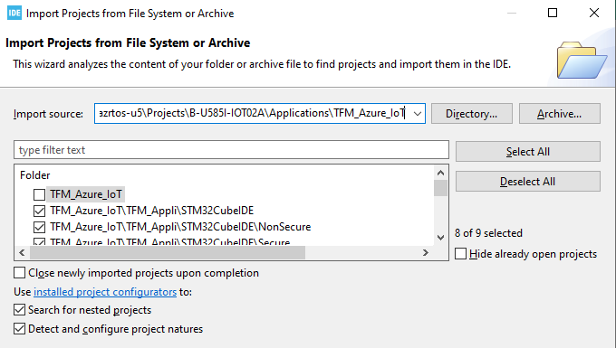
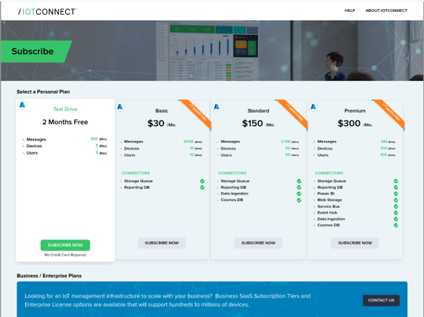
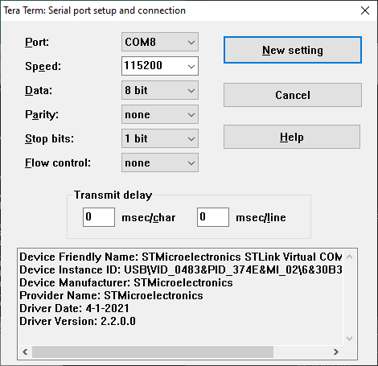

## Introduction

This document aims to provide a step-by-step-guide way to test and evaluate the 
[B-U585I-IOT02A STM32U4 Discovery kit for IoT](https://www.st.com/en/evaluation-tools/b-u585i-iot02a.html) board 
with IoTConnect.


### Project Build Setup

The software must be built and programmed onto the board by using the following steps:

* If on Windows, download and install either [Git Bash](https://git-scm.com/downloads) (Select to install Git Bash in the Setup Wizard). 
[MSYS2](https://www.msys2.org/) or [WSL](https://learn.microsoft.com/en-us/windows/wsl/about) may also work, but are not primarily tested.
* Ensure that you have git command line installed or a tool that can clone Git repositories.   
* Clone this repo
* Download the [X-CUBE-AZURE Expansion Package](https://www.st.com/en/embedded-software/x-cube-azure.html) version 2.3.0, 
and place the zip into the the root directory of the cloned repository.
* In a bash shell, execute:

```shell
cd <root of this repo>
IoTConnect/scripts/setup-project.sh 
```

* Download, install and open the [STM32CubeIDE](https://www.st.com/en/development-tools/stm32cubeide.html).
* In STM32CubeIDE, select *File -> Open Projects from File System*.
* Select the directory **Projects/B-U585I-IOT02A/Applications/TFM_Azure_IoT** 
directory of this repo in the dialog box and click *Finish*.
* Uncheck the **TFM_Azure_IoT** top level root project and leave the other project checked like this:



* Build the TFM_Appli/TFM_Appli_Secure project. This will trigger the build for all other components
except for the Non-Secure application.
* After the Secure build completes, build the TFM_Appli/TFM_Appl_NonSecure project.

### IoTConnect Subscription Information

[IoTConnect](https://iotconnect.io) is availabe as a SaaS hosted subscription service or available as a PaaS subscription hosted on a client's infrastructure. SaaS IoTConnect subscriptions are available for business and personal accounts, and both are deployed on a production cloud instance.  Personal accounts are currently available through a North American instance of IoTConnect built on Microsoft Azure and is available for global use.  Personal IoTConnect accounts support between 1 and 100 devices, and can be setup in minutes through credit card payment on [IoTConnect Subscription Site](https://subscription.iotconnect.io/subscribe). Business SaaS accounts are available on both AWS and Azure, and deployed on EMEA and North American instances.  The Business SaaS platforms will support 1 to over a million devices, allow unlimited users, and can be setup in 1-business day through your local Avnet, Avnet Silica, Avnet Abacus, and EBV Elektronik account managment team. If you are not connected to an Avnet representative already, one can be reached by the "Contact Us" link on the Subscription Page. PaaS subscriptions are available in all Azure and AWS serviced regions, and require an Avnet license agreement and a cloud subscription service through Anvet or directly through the cloud sevices provider. 

For registration, you will need an email address, phone number, and unique company name. When you sign up for an account, you are creating an organizational instance.  You can add others later into this account with various permissions, including admistrative rights.  But note that users within the same organization, as well as device users, do not require their own seperate IoTConnect subscriptions.   

**IoTConnect Trial Account**  
A 2-Month Test Drive is available through the [IoTConnect Subscription Site](https://subscription.iotconnect.io/subscribe).  This version allows up to 5 devices, 5 users, and 30K messages per month, and does not require creditcard information for registration.  In addition, all paid tiers provide a 1-month trial period. The second month will be billed 30-days after sign-up and can be cancelled anytime through the [subcription management portal](https://subscription.iotconnect.io).



### Device Setup

* A serial console application, such as [Tera Term](https://ttssh2.osdn.jp/index.html.en), is required for the next steps. 
Configure settings per the screenshot below:



Follow the [Device Configuration section of the QuickStart Guide](QUICKSTART.md#device-configuration)

### IoTConnect Template Setup with Pre-made import
A Device Template with Self Signed authentication type will need to be imported.
* Download the premade [Device Template with Self-Signed Auth](https://github.com/avnet-iotconnect/avnet-iotconnect.github.io/blob/main/documentation/templates/devices/stm32u5/stm32u5self_signed_template.JSON).
* Import the template into your IoTConnect instance. (A guide on [Importing a Device Template](https://github.com/avnet-iotconnect/avnet-iotconnect.github.io/blob/main/documentation/iotconnect/import_device_template.md) is available or for more information on [Template Management](https://docs.iotconnect.io/iotconnect/user-manuals/devices/template-management/), please see the [IoTConnect Documentation](https://iotconnect.io) website.)

### Known Issues
* The OTA and ADU support features should not be used. These features are still work in progress.